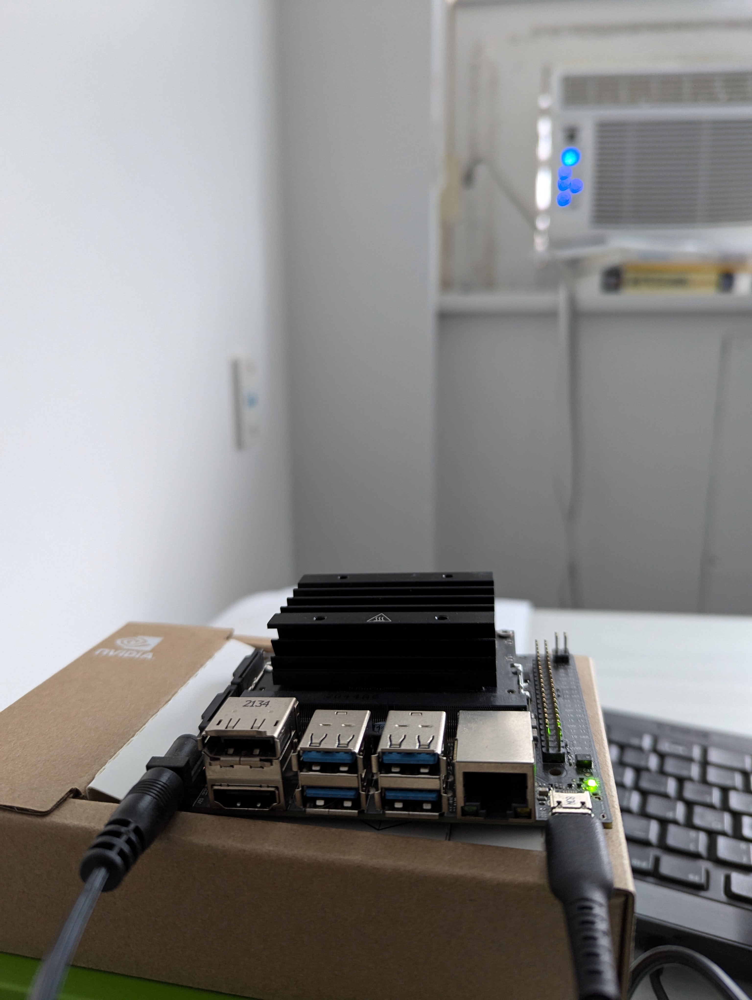

# AgentsonEdge
Deployment and Analysis of TinyLlama 1.1B on Nvidia Jetson Nano: A Study of Query Workloads in Resource-Constrained Environments


## Abstract
Edge devices are characterized by constraints in computational power, memory, and other resources, coupled with their small form factors, limited power supply, and heat dissipation capabilities. With the advancement of large language models (LLMs) and inference technologies, the deployment of AI-powered agents has become increasingly feasible. This raises a critical question: can edge devices effectively support the machine learning workloads associated with LLM-powered agents? This project  aims to explore the feasibility and establish a baseline for deploying such agents on edge devices. Specifically, this project involved analyzing the resource usage of query workloads associated with an LLM agent deployed on an Nvidia Jetson Nano board for which a small language model, TinyLlama 1.1B, was deployed using the Llama.cpp inference runtime on Jetson Nano 4GB module. The query workload was categorized into five types—simple, complex, conversational, contextual, and task-oriented—and system usage was measured to analyze the resulting trends.


## Introduction to the Problem
Edge devices present a compelling use case for LLM agents due to their ability to perform inference locally, which is particularly valuable in applications where data privacy, connectivity limitations, or ecosystem boundaries are significant concerns. The primary question addressed in this project is whether these devices can effectively manage the workload demands of deploying locally hosted small language models, given their inherent memory and hardware constraints.
The analysis focuses on the Nvidia Jetson Nano developer kit board, selected as a representative edge device. This choice establishes specific limitations in terms of memory capacity and software compatibility, as the Jetson Nano is an older model compared to the newer Jetson Orin Nano, which is currently supported by Nvidia. 


## Problem Objectives
#### Deployment Feasibility:
- Can a small LLM be successfully deployed on the Nvidia Jetson Nano Developer Kit (4GB edition) for text-based tasks without rendering the system unusable for other processes? Additionally, does the system have sufficient capacity to incorporate wrapper files for local agents while executing queries through the LLM?


#### Workload Analysis:
- How do various types of query workloads associated with an LLM agent perform on edge devices? What trends and patterns are observed in these performances, and what underlying factors contribute to these outcomes?
- Are there specific limitations or weaknesses in deploying LLMs on edge devices for particular workloads?


## Explanation
You can find the writeup walking you through the project in detail [here](<docs/blog/Agents on Edge.md>).



<video src="docs/assets/chat_demo.mp4" controls title="Title"></video>


## Notes


1. The Importance of LLM Inference on Edge

Performing inference directly on edge devices, such as the Jetson Nano, offers several significant advantages. First, it eliminates the need for data to travel to a central server or cloud for processing, thereby drastically reducing response time—a critical factor for applications requiring quick decision-making or real-time feedback, such as autonomous vehicles, real-time language translation, and interactive customer service systems.

Furthermore, processing data locally ensures that sensitive information remains on the device, which is crucial for maintaining confidentiality in sectors like healthcare and finance, where data privacy is paramount. Edge devices also operate independently of the cloud, enabling continued functionality even during network outages. This reliability is essential for remote monitoring systems in agriculture, healthcare in isolated areas, and industrial IoT applications where uninterrupted operation is necessary. Local data processing also aids in compliance with regulations such as the GDPR in Europe, which imposes strict rules on data transfer and storage, particularly concerning the handling of personal data across borders.


2. Significance of Deploying SLM Agents on Edge Devices

The local processing capability of edge devices also supports a range of use cases (for robots or drones) where mobility is critical. These can be integrated into surveillance systems to interpret and respond to audio cues or alerts. In healthcare, on-device, real-time interaction can provide support through medication reminders, basic diagnostics, and health advice. In industrial IoT, edge LLMs can enable predictive maintenance and real-time monitoring of machinery in environments where internet access is limited or unreliable. Additionally, on-device analysis of sensitive documents can ensure compliance with data protection regulations, minimizing the risk of data leakage.


3. Nvidia Jetson Nano Unified memory

The Jetson Nano board features a unified memory management system, where the CPU and GPU share a common pool of DRAM. This allows memory allocated by the CPU to be directly accessed by the GPU and vice versa. Special care is required when working with PyTorch GPU code, as it typically does not account for unified memory architecture, potentially leading to data being copied twice in memory—once by the CPU and once by the GPU.


4. Additional steps for compiling gcc 8.5 and llama.cpp on device

We referenced the steps by Flor Sanders described[ here](https://gist.github.com/FlorSanders/2cf043f7161f52aa4b18fb3a1ab6022f) and added some modifications to suit our environment.


    1. GCC Compiler Setup:

The board ships with GCC 7, which is incompatible with llama.cpp, necessitating the installation of GCC 8.5. Since JetPack 4.6 does not natively include GCC 8.5, we built it from source. We downloaded the GCC 8.5 source files and pre-requisites, configured them with the following options: `-enable-checking=release -enable-languages=c,c++`, and then built and installed GCC 8.5 on the device. We set up the GCC and G++ environment variables to ensure that the llama.cpp makefile would utilize these. \


    2. Cloning and Configuring Llama.cpp:

We cloned the llama.cpp repository and checked out a known working commit compatible with the JetPack 4.6 software stack (`git checkout a33e6a0`). The makefile for llama.cpp required specific modifications:


* **MK_NVCCFLAGS**: Set `maxrregcount=80`.
* **MK_CXXFLAGS**: Removed the `mcpu=native` flag.

We also added the CUDA toolkit to the system path to enable `nvcc` for compiling llama.cpp. The compute capability of the Jetson Nano module was determined to be 5.3, which was used during the build process with the command:


```
    make LLAMA_CUBLAS=1 CUDA_DOCKER_ARCH=sm_53 -j 6

```


    3. Running Inference:

After storing the TinyLlama model on the device, we executed inference by invoking the main file in llama.cpp with the following command:


```
    /nano-llama/llama.cpp/main -m /nano-llama/llama.cpp/TinyLlama-1.1B-Chat-v1.0-Q5_K_M.gguf -p "You are a very helpful AI assistant who gives to the point responses to the user: Hi, how are you today?"
```


### 5. Challenges and Solutions related to deployment

During the deployment of the TinyLlama model on the Jetson Nano, several challenges were encountered, which required specific workarounds and solutions.


#### Difficulties Faced During Deployment


1. **Flashing the SD Card**:
    * **Issue**: The SD card flash process can fail if the lock switch on the SD card adapter is engaged, even though formatting may still work. \

    * **Solution**: Ensure that the lock switch is in the correct position before flashing. The locked status will be reflected in the Etcher tool, so verify it there as well. \

2. **Power Management**:
    * **Issue**: Running the Jetson Nano in 5W mode (default when using micro-USB) can lead to throttling of system resources. \

    * **Solution**: Use a power adapter to run the board in 10W mode. Connect the J48 Power Select Header pins using jumpers to disable power supply via micro-USB. \

3. **JetPack SDK Limitations**:
    * **Issue**: The Jetson Nano 4GB is limited to JetPack 4.6.5, which includes Jetson Linux 32.7.5 based on Ubuntu 18.04, CUDA 10.2, cuDNN 8.2, TensorRT 8.0, and GCC 7. This restricts the versions of software and libraries that can be deployed. \

    * **Solution**: Ensure that all dependencies for workloads are compatible with this environment to take advantage of the GPU. \

4. **Building GCC 8 Compiler**:
    * **Issue**: Building the GCC 8.5 compiler on the Jetson Nano board is a time-consuming process, taking approximately 4-5 hours. \

    * **Solution**: Use a larger SD card (128GB) to accommodate the base OS image, which occupies 15-20GB, leaving sufficient space for models and experiments. After installing the GCC compiler, clear the build files to free up space. \

5. **Cross-Compilation Challenges**:
    * **Issue**: Cross-compiling llama.cpp on a different Unix machine (Intel x64) introduced complexities, such as setting up the ARM cross-compiler, copying necessary libraries and headers, and configuring GCC with sysroot support. Additionally, the llama.cpp makefile required numerous environment variables, which were challenging to configure. \

    * **Solution**: After several errors, it was concluded that building both the GCC compiler and llama.cpp directly on the Jetson Nano, using Flor Sanders's steps, was more efficient. Although transferring the built GCC compiler to the Jetson Nano was theoretically possible, the complexity of environment setup led to the decision to build directly on the board.


### 6. Data fields recorded using jetson stats

**(**[https://rnext.it/jetson_stats/reference/jtop.html#jtop.jtop.stats](https://rnext.it/jetson_stats/reference/jtop.html#jtop.jtop.stats))


<table>
  <tr>
   <td>
    <strong>Name</strong>
   </td>
   <td>
    <strong>Type</strong>
   </td>
   <td>
    <strong>Reference</strong>
   </td>
   <td>
    <strong>Description</strong>
   </td>
  </tr>
  <tr>
   <td>
    time
   </td>
   <td>
    <code><a href="https://docs.python.org/3/library/datetime.html#datetime.datetime">datetime.datetime</a></code>
   </td>
   <td>
   </td>
   <td>
    local time in your board
   </td>
  </tr>
  <tr>
   <td>
    uptime
   </td>
   <td>
    <code><a href="https://docs.python.org/3/library/datetime.html#datetime.timedelta">datetime.timedelta</a></code>
   </td>
   <td>
    <code><a href="https://rnext.it/jetson_stats/reference/jtop.html#jtop.jtop.uptime">uptime</a></code>
   </td>
   <td>
    up time on your board
   </td>
  </tr>
  <tr>
   <td>
    cpu X
   </td>
   <td>
    <code><a href="https://docs.python.org/3/library/functions.html#float">float</a></code>
   </td>
   <td>
    <code><a href="https://rnext.it/jetson_stats/reference/jtop.html#jtop.jtop.cpu">cpu</a></code>
   </td>
   <td>
    The status for each cpu in your board, if disabled <em>OFF</em>
   </td>
  </tr>
  <tr>
   <td>
    RAM
   </td>
   <td>
    <code><a href="https://docs.python.org/3/library/functions.html#float">float</a></code>
   </td>
   <td>
    <code><a href="https://rnext.it/jetson_stats/reference/jtop.html#jtop.jtop.memory">memory</a></code>
   </td>
   <td>
    RAM used / total
   </td>
  </tr>
  <tr>
   <td>
    SWAP
   </td>
   <td>
    <code><a href="https://docs.python.org/3/library/functions.html#float">float</a></code>
   </td>
   <td>
    <code><a href="https://rnext.it/jetson_stats/reference/jtop.html#jtop.jtop.memory">memory</a></code>
   </td>
   <td>
    SWAP used / total
   </td>
  </tr>
  <tr>
   <td>
    EMC
   </td>
   <td>
    <code><a href="https://docs.python.org/3/library/functions.html#float">float</a></code>
   </td>
   <td>
    <code><a href="https://rnext.it/jetson_stats/reference/jtop.html#jtop.jtop.memory">memory</a></code>
   </td>
   <td>
    <em>(Optional)</em> EMC Percentage of bandwidth
   </td>
  </tr>
  <tr>
   <td>
    IRAM
   </td>
   <td>
    <code><a href="https://docs.python.org/3/library/functions.html#float">float</a></code>
   </td>
   <td>
    <code><a href="https://rnext.it/jetson_stats/reference/jtop.html#jtop.jtop.memory">memory</a></code>
   </td>
   <td>
    <em>(Optional)</em> IRAM used / total
   </td>
  </tr>
  <tr>
   <td>
    GPU
   </td>
   <td>
    <code><a href="https://docs.python.org/3/library/functions.html#float">float</a></code>
   </td>
   <td>
    <code><a href="https://rnext.it/jetson_stats/reference/jtop.html#jtop.jtop.gpu">gpu</a></code>
   </td>
   <td>
    <em>(Optional)</em> Status of your GPU
   </td>
  </tr>
  <tr>
   <td>
    engine X
   </td>
   <td>
    <code><a href="https://docs.python.org/3/library/functions.html#float">float</a></code>
   </td>
   <td>
    <code><a href="https://rnext.it/jetson_stats/reference/jtop.html#jtop.jtop.engine">engine</a></code>
   </td>
   <td>
    <em>(Optional)</em> Frequency for each engine, if disabled <em>OFF</em>
   </td>
  </tr>
  <tr>
   <td>
    fan
   </td>
   <td>
    <code><a href="https://docs.python.org/3/library/functions.html#float">float</a></code>
   </td>
   <td>
    <code><a href="https://rnext.it/jetson_stats/reference/jtop.html#jtop.jtop.fan">fan</a></code>
   </td>
   <td>
    <em>(Optional)</em> Fan speed
   </td>
  </tr>
  <tr>
   <td>
    Temp X
   </td>
   <td>
    <code><a href="https://docs.python.org/3/library/functions.html#float">float</a></code>
   </td>
   <td>
    <code><a href="https://rnext.it/jetson_stats/reference/jtop.html#jtop.jtop.power">power</a></code>
   </td>
   <td>
    <em>(Optional)</em> Current power from rail X
   </td>
  </tr>
  <tr>
   <td>
    Temp TOT
   </td>
   <td>
    <code><a href="https://docs.python.org/3/library/functions.html#float">float</a></code>
   </td>
   <td>
    <code><a href="https://rnext.it/jetson_stats/reference/jtop.html#jtop.jtop.power">power</a></code>
   </td>
   <td>
    <em>(Optional)</em> Total power
   </td>
  </tr>
  <tr>
   <td>
    jetson_clocks
   </td>
   <td>
    <code><a href="https://docs.python.org/3/library/stdtypes.html#str">str</a></code>
   </td>
   <td>
    <code><a href="https://rnext.it/jetson_stats/reference/jtop.html#jtop.jtop.jetson_clocks">jetson_clocks</a></code>
   </td>
   <td>
    <em>(Optional)</em> Status of jetson_clocks, human readable
   </td>
  </tr>
  <tr>
   <td>
    nvpmodel
   </td>
   <td>
    <code><a href="https://docs.python.org/3/library/stdtypes.html#str">str</a></code>
   </td>
   <td>
    <code><a href="https://rnext.it/jetson_stats/reference/jtop.html#jtop.jtop.nvpmodel">nvpmodel</a></code>
   </td>
   <td>
    <em>(Optional)</em> NV Power Model name active
   </td>
  </tr>
</table>


### 7. Instruction appended to each query

The length of prompt referred to in the experiments includes the tokens instructing the model what is to be done for each query category.


```

query_category_prompts = {
"complex": "You are a helpful assistant. Give a short answer. Query: $$**$$ Answer: ",
 "contextual": "You are a very helpful assistant. Answer the question: $$**$$ Answer: ",
 "conversational": "You are a helpful assistant.> User: $$**$$? Assistant: ",
"simple": "You are a helpful assistant who knows everything. Give a short answer. Query: $$**$$ Answer: ",
"task-oriented": "$$**$$ <BOT>: Great! Based on the provided information, following are the steps: "}
```


### 8. Query samples from experiments


#### Queries picked for granular experiments (median length)

**Simple**


```
what is i2c i/f
```


**Complex**


```
Who do states and governments often work in lockstep with?
```


**Contextual**


```
::context:: kinison acquired much of his material from his difficult first two marriages, to patricia adkins (1975-1980) and terry marze (1981-1989). he began a relationship with dancer malika souiri toward the end of his marriage with marze. in 1990, souiri alleged she was raped by a man kinison had hired as a bodyguard that same day, while kinison was asleep in the house. the bodyguard stated that the sex was consensual; the jury deadlocked in the subsequent trial and the charges were later dropped. on april 4, 1992, six days before his death, kinison married souiri at the candlelight chapel in las vegas. they honeymooned in hawaii for five days before returning home to los angeles on april 10 to prepare for a show that night at the riverside resort hotel and casino in laughlin, nevada. souiri sued kinison's brother bill in 1995 for allegedly defaming her in his book brother sam: the short spectacular life of sam kinison, and then again in 2009 for allegedly forging sam's will. in february 2011, the toronto sun reported that kinison had fathered a child with the wife of his best friend and opening act, carl labove, who had been paying child support for the girl for nearly 13 years. labove filed legal papers claiming the girl was kinison's, and dna tests taken from kinison's brother bill show a 99.8% likelihood that kinison was the father of the unnamed woman, who was 21 at the time of the toronto sun story, and excluded labove as her father. ::question:: who did he marry?
```


**Conversational**


```
I know, I know I really like you too. But we-we cant date. Its against the rules. Its forbidden.
```


**Task Oriented** \
<code><em>This is a bot helping users to find a restaurant and book a train ticket. Given the dialog context, please generate a relevant system response for the user. : &lt;USER> Are there trains arriving in Cambridge before 18:45 on Sunday? &lt;USER> I'm leaving Bishops stortford. &lt;USER> Can I get the price, travel time, and departure time of the one arriving at 18:07? &lt;USER> Not at this time, but I am also looking for a european food restaurant in the expensive price range. Can you help with that? &lt;USER> In the centre of town please. &lt;USER> Yes, please. It will be just me and I'd like to eat at 21:00 on the same day as my train. </em></code>


#### Queries used for experiment: Validation of Query Execution Time Relative to Token Count and Query Complexity

**Task-oriented**


```
This is a bot helping users to complete multiple tasks, e.g. find a restaurant, find a taxi, and find a hotel. Given the dialog context, please generate a relevant system response for the user. : <USER> Find me a Mediterranean restaurant in the centre of Cambridge. <USER> Yes, please book that for me. <USER> I need the table booked for monday at 12:15 for 3 people. Thanks. Also could i get the ref #? <USER> Great I also am looking for a hotel to stay at that includes free parking. What's available? <USER> Actually, I'm looking for a hotel and in the same price range as the restaurant. <USER> Yes I need a hotel in the same price range as the restaurant with free parking. <USER> Can you give me the first one and the star rating for it please? It has to have free parking. <USER> Does the Express by Holiday Inn have free parking? <USER> Yes also I will need a taxi to get me between the hotel and the restaurant. I will need a contact number and car type with the booking. <USER> I'd just like to book a taxi between the two. I'd like to get to the restaurant by my reservation time and I'll need the contact number and car type please. <USER> What time will the taxi arrive? <USER> That will be fine. 
```


**Contextual**


```
::context:: by the beginning of 2004 the band announced their first greatest hits compilation was going to be released, a cover of nick kamen's "i promised myself" became the last single from the band. the band shot the video for the song in march 2004, and was premiered on ztv in early april, the song went to international radios on late april/may becoming the last hit of the band. the album was a compilation of thirteen singles, which each one of them made the top twenty in at least one country and three new tracks, two of them were written by the band members. promotion for the album was slow, the band did a few shows in sweden and international interviews to magazines. many were reporting the band was splitting up after six years in the pop world. the band quickly denied the rumours on their official website. the single became another top-two hit for the band in sweden, it became one of the band's biggest hits in south america (especially in argentina) and the album became the band's first to not make the top ten in their homeland while it brought back the attention to them in other countries in latin america and eastern europe. the album was just released in selected european countries, asia and latin america. it did not receive a u.s. release, although, when mca records went bankrupt and was absorbed by both geffen and interscope, the former had plans to release it in november, ready for the christmas sales, but plans were scrapped when the band finished their tour and dhani released his first solo single. ::question:: why did they release this
```


#### Query used for experiment: GPU Memory Usage and Output Length Analysis

Same conversational query executed with increasing number of expected output tokens.


```
I know, I know I really like you too. But we-we cant date. Its against the rules. Its forbidden.
```


#### Queries used for experiment: GPU Memory Usage with Varying Input Tokens

Four task-oriented queries with different prompt lengths executed with the same number of expected output tokens (50).

**(90 tokens**[^1]**)**


```
This is a bot helping users to find a restaurant. Given the dialog context, please generate a relevant system response for the user. : <USER> I am looking for a cheap restaurant in the centre. <USER> Yes, may I have the address, postcode, and phone number for Golden House? I'll book it myself.
```


**(157 tokens**[^2]**)**


```
This is a bot helping users to find a restaurant and find an attraction. Given the dialog context, please generate a relevant system response for the user. : <USER> Hi I am looking for a college to go to in town. <USER> Yes, the centre area. <USER> Yes, and can you find me an Italian restaurant in the same area? <USER> Yes, I'm looking for something expensive. <USER> I think I'll try the Caffe Uno. Can I get a table for 5 at 12:15 on Sunday? <USER> Yes could I have my booking reference number please?
```


**(224 tokens)**[^3]


```
This is a bot helping users to complete multiple tasks, e.g. find a restaurant, book a train ticket, and find a hotel. Given the dialog context, please generate a relevant system response for the user. : <USER> Can you help me find a train departing from cambridge going to kings lynn? <USER> I want to leave on Thursday and arrive by 14:00. <USER> I don't have a specific time to leave but I do want to arrive before 14:00. How much will this cost? <USER> No thanks. Not at this time. Can you help me find a room to stay that is moderately priced? <USER> No, I don't care where it is. I like 3 stars and I absolutely need free wifi. <USER> Yes, make the reservation please. <USER> Actually I don't need a reservation at this time.
```


**(334 tokens)**[^4]


```
This is a bot helping users to complete multiple tasks, e.g. find a restaurant, find a taxi, and find a hotel. Given the dialog context, please generate a relevant system response for the user. : <USER> Find me a Mediterranean restaurant in the centre of Cambridge. <USER> Yes, please book that for me. <USER> I need the table booked for monday at 12:15 for 3 people. Thanks. Also could i get the ref #? <USER> Great I also am looking for a hotel to stay at that includes free parking. What's available? <USER> Actually, I'm looking for a hotel and in the same price range as the restaurant. <USER> Yes I need a hotel in the same price range as the restaurant with free parking. <USER> Can you give me the first one and the star rating for it please? It has to have free parking. <USER> Does the Express by Holiday Inn have free parking? <USER> Yes also I will need a taxi to get me between the hotel and the restaurant. I will need a contact number and car type with the booking. <USER> I'd just like to book a taxi between the two. I'd like to get to the restaurant by my reservation time and I'll need the contact number and car type please. <USER> What time will the taxi arrive? <USER> That will be fine. 


<!-- Footnotes themselves at the bottom. -->
## Notes

[^1]:
     The prompt token count here also includes the number of instruction tokens.

[^2]:
     The prompt token count here also includes the number of instruction tokens.

[^3]:
      The prompt token count here also includes the number of instruction tokens.

[^4]:
      The prompt token count here also includes the number of instruction tokens.
