## plots

There are two kinds of plots.

1. Across the workload when 5 sets of 100 queries each were submitted and plotted. (recorded per half second)

2. Granular - when readings were recorded for a single query of each type per 1/100th of a second.

3. Number of CPU = 4
    Thread(s) per core:  1
    Core(s) per socket:  4
    Socket(s):           1

*Figure 1. Median prompt lengths across categories*
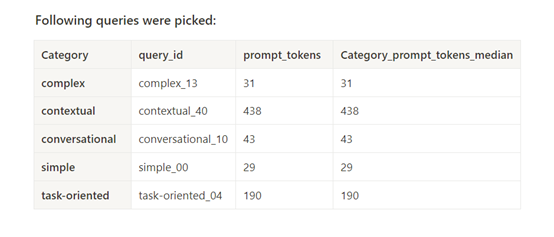

*Figure 2. Analysis of CPU and GPU Memory Usage across workloads*
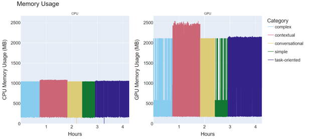

*Figure 3. Zoomed in CPU memory usage across workloads*
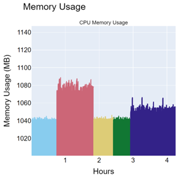

*Figure 4: Mean prompt length across categories*
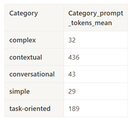

*Figure 5. Average CPU and GPU usage across workloads. *
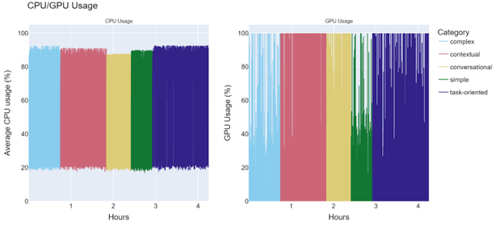

***Limits on number of output tokens: ***
*{"complex": "70", "contextual": "50", "conversational": "40", "simple": "30", "task-oriented": "100"}*

*Figure 6. Time to First token (TTFT) and Time between Tokens (TBT) across workloads.*
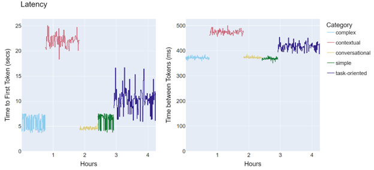

*Figure 7. Total time per query vs Tokens in Prompt across workloads.*
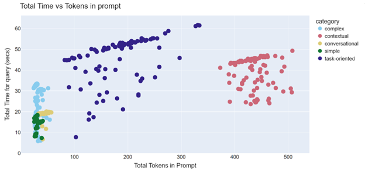

*Figure 8. Average CPU and GPU use for a single query.*
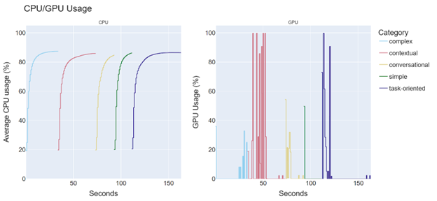

*Figure 9. CPU and GPU memory usage for individual queries.*
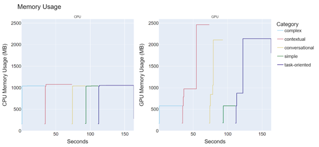

*Figure 10. Same conversational query executed with increasing number of expected output tokens*
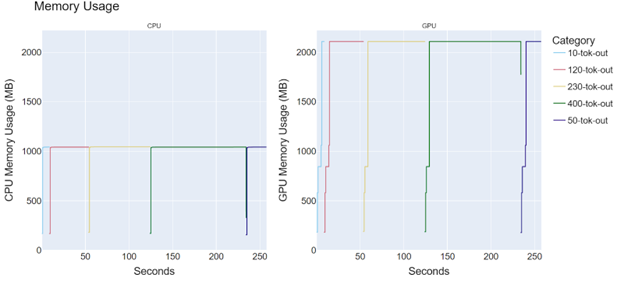

*Figure 11. (Zoomed version) Four task-oriented queries with different prompt lengths executed with the same number of expected output tokens (50).*
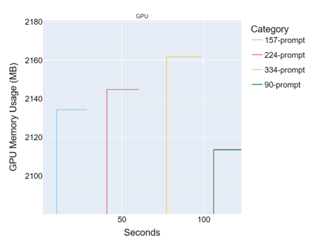

*Figure 12. Total query time comparison for similarly sized contextual and task-oriented query.*
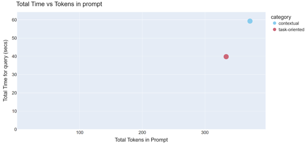

